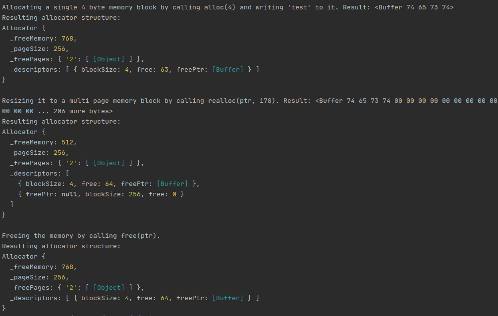

# Page Allocator
Sample implementation written in `TypeScript`.

## Принцип работы

Вся память, которая доступна аллокатору, делистя на страницы одинакового размера.

В свою очередь, страницы разделены на блоки фиксированого и одинакового размера. Это деление происходит непосредственно при выделении памяти и при первом использовании чистой страницы, так как мы не можем знать заранее блоки какого размера нам понадобятся.

Все блоки, которые мы выделяем делятся на два типа: те, что размером меньше, чем половина страницы, либо же больше. Страница может быть пустой, разделенной на блоки, либо же занятой многостраничным блоком.

Аллокатор хранит такие данные о страницах:
* дескрипторы, которые хранят информацию о странице: размер блока, кол-во свободных блоков, указатель на первый свободный блок
* словарь свободных страниц, где ключом является размер блока страницы

# Alloc

```typescript
alloc(size: number): Block;
```
В случае если запрашиваемый размер меньше чем половина страницы, то округляем его до ближайшей степени двойки. Если нет свободных страниц, разбитых на блоки нужного, размера, то создаем такую, вместе с ее дескриптором. В противном случае в дескрипторе нужной страницы редактируем информацию и возвращаем первый свободный блок.

В другом случае, выделяем в памяти нужное количество страниц для размещения мультистраничного блока. Для каждой страницы создаем дескриптор, но данные про выделенную память вносим лишь в первый.

# Free

```typescript
free(ptr: Block);
```

В случае освобождения не мультистраничного блока, ищем дескриптор для нужной страницы, редактируем данные, вносим блок в список свободных для этой страницы, и ссылкой на первый свободный блок на странице делаем его.

В случае с мультистраничным блоком, просто очищаем дескрипторы для тех страниц, что отвечают за даный блок.

# Realloc
```typescript
realloc(ptr: Block, size: number): Block;
```

Для перевыделения памяти последовательно выделяем новый блок памяти, копируем данные из старого блока в новый, и удаляем старый блок. Логика выделения и удаления использует вышеописаные функции `alloc` и `free` соответсвенно.

# Пример работы
```typescript
const a = new Allocator();

let ptr = a.alloc(4);
ptr.write('test');
console.log("\nAllocating a single 4 byte memory block by calling a.alloc(4) and writing 'test' to it. Result:", ptr)
console.log("Resulting allocator structure:")
console.dir(a);

ptr = a.realloc(ptr, 178);
console.log("\nResizing it to a multi page memory block by calling a.realloc(ptr, 178). Result:", ptr);
console.log("Resulting allocator structure:")
console.dir(a);

a.free(ptr);
console.log("\nFreeing the memory by calling a.free(ptr).");
console.log("Resulting allocator structure:")
console.dir(a);
```
