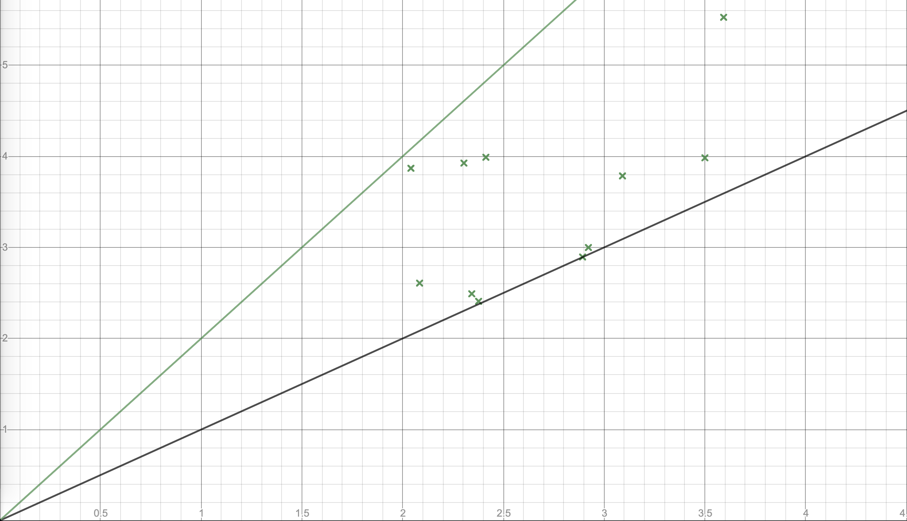

Реализация стратегии обработки задач в виде стека (LIFO) без приоритетов.
Данная програма запускает цикличный алгоритм, который в течении отрезка времени обрабатывает задачи из стека задач.
Во время обработки задач, в стек могут добавлятся новые задачи, поэтому приоритет при выборе последующей задачи всегда придается последней добавленной в стек.

Ниже приведен график, где показана зависимость времени на выполнение задачи от времени, что требуется на её выполенение при:
* времени на выполнения задачи: от 2с до 4с
* частоте добавления новых задач в стек: от 0.5с до 2.5с

- ось x - время на выполнение одной задачи
- ось y - время, что потребовалось в действительности
- черная линия y = x
- зеленая линия y = 2x