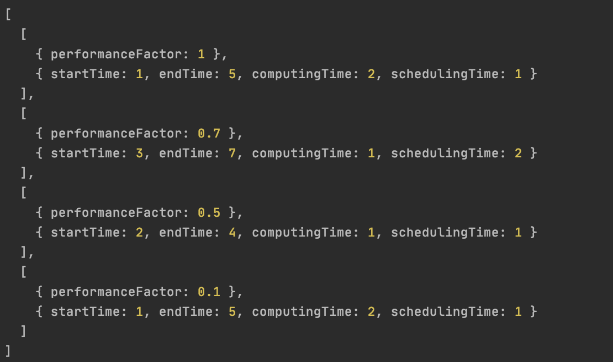

Даная лабораторная реализует исключительную пространственную планировку на языке typescript.

Единственная функция класса Scheduler принимает на вход аргументами массив задач и массив нод, что могут выполнить даные
задачи. Каждая нода имеет коефициент продуктивности. Каждая задача имеет время начала, окончания (дедлайн), время
требуемое на выполнение, время требуемое для постановки в очередь.

На основе входных данных планировщик сначала строит матрицу относительной эффективности каждой ноды для каждой задачи,
после чего строит матрицу веса задачи для каждой ноды, учитывая входные параметры задачи. Далее для каждой задачи ищется
 подходящая нода. При успешном поиске, из матрицы удаляется ряд/столбик для соответсвующей комбинации задачи/ноды. После
 цикл повторяется, пока матрица не окажется пустой. На выходе получаем комбинации задач и оптимальных для планирования нод.

Результат выполнения программы на тестовых данных:

