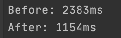

В данной лабораторной была проведена оптимизация и профилирование работы функции.

Изменения внесенные в код программы:
* убрана переменная ```res```, которая не используется;
* две операции инкрементирования переменной заменены на одну операцию добавления 2;
* изменен порядок итерирования - вместо уменьшения итератора, увеличиваем его, так быстрее.

Результат выполнения до и после изменений с засеченным временем работы:




