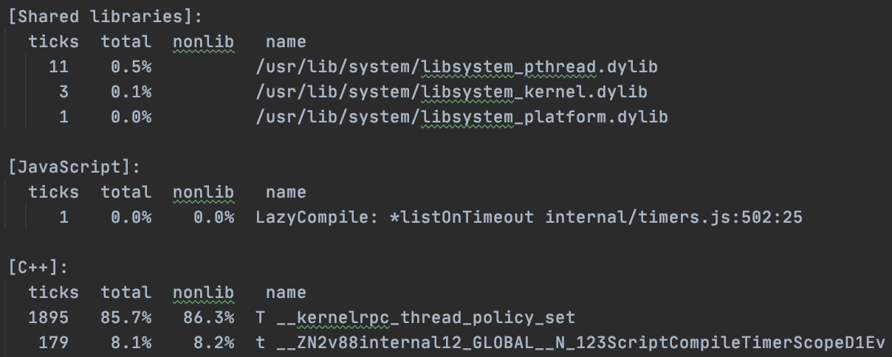
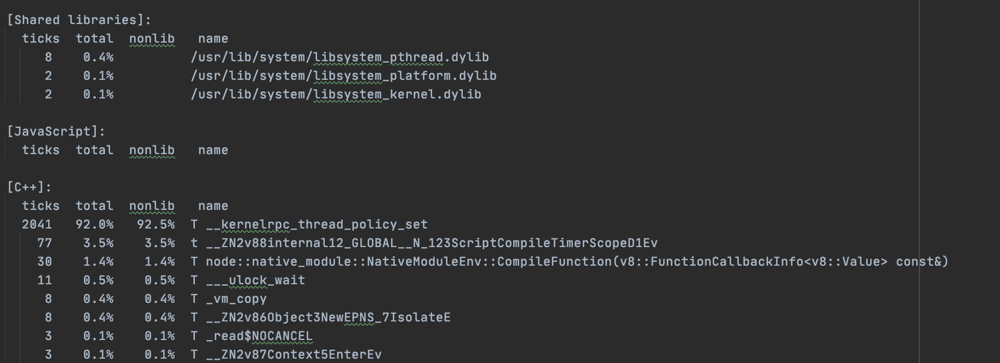

В рамках данной лабораторной работы было проведено профилирование кода программы из примера.
В коде программы вызываются две разные фукции, в зависимости от входного аргумента, которые ведут себя одинаково, и вызывают ожидания треда ```sleep(1000)```
в цикле из миллиарда итераций, вызовы этих операций тоже происходят в цикле из 255 итераций.
Можно заметить что суммарно это очень большое количество программного времени. В настоящей программи нужно делать реальные оптимизации кода
в циклах - уменьшать количество итерации или работы в одной итерации. Кроме этой очевидной вещи, в примере кода можно убрать объявление функции без объявления тела
для оптимизации памяти, а так же внести переменную итератор в тело цикла, а не держать во внешней области видимости.

Для итогового профилирования кода программы я переписал даную программу на скрипт на JS, уменьшил количество ожидания, и
запустил его с профайлером Node.js:

```node --prof updated.js <cat|dog>```

Выходным файлом является не очень читаемый формат с тиками процесса. Для информации по функциям и методам, а также по месту вызова
нужно распарсить логи командой

```node --prof-process <log> > <output>```

Пример логов времени процессора что занимает функция "рисования кота"
, против времени процессора что занимает функция "рисования пса":





Так как в обновленной реализации для примера функция рисования собаки занимает больше процессорного времени с помощью ожидания интервалов,
видим что бОльшая часть времени процессора там уходит на вызовы из нативного кода, где и реализованы таймеры.